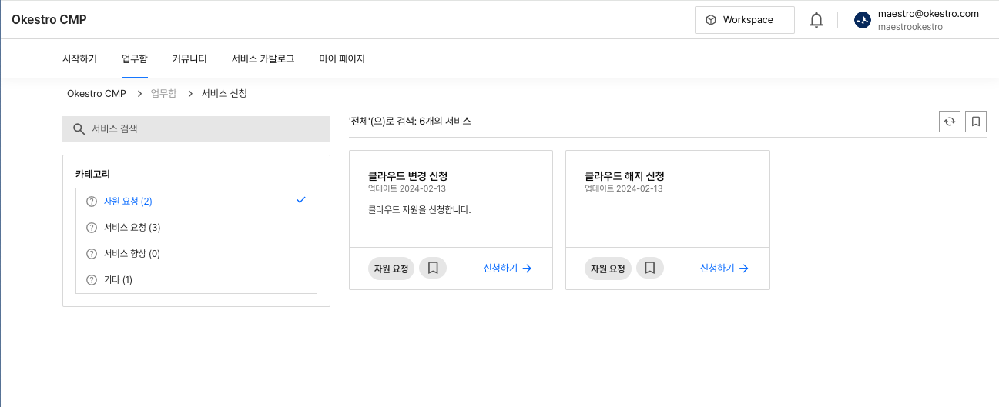

# 서비스 신청

<!-- 타이틀 -->
# 서비스 신청 조회하기
<!-- 본문 -->
카테고리별 신청 양식을 통해 필요한 서비스를 요청할 수 있습니다. 업무 패턴에 따라 승인 과정이 포함될 수 있습니다. 
주로 이용 되는 서비스 신청은 다음과 같습니다.

<!-- 목록 -->

* 클라우드 자원 신청
* 자원 변경(쿼터 변경)
* 자원 해지/반납

아래는 서비스 신청 목록 화면입니다. 

<!-- 이미지 첨부 -->

<!-- 주의사항 -->
!!! note "주의사항"
    모든 프로젝트에 동일한 서비스 양식이 포함되지 않습니다. 
    요건에 따라 필요한 서비스 신청 양식만 포함됩니다.

<!-- 사용팁 -->
!!! tip "사용팁"
    사용자에게 권장 사용 방법 혹은 빠른 사용법을 작성합니다. 
    부가성 정보입니다.

<!-- 경고 -->
!!! warning "경고"
    사용자에게 주의가 필요한 경고성 문구를 작성합니다. 
    시스템에 장애가 발생하지 않습니다.

<!-- 위험 -->
!!! danger "위험"
    사용자에게 필요한 강한 경고성 문구를 작성합니다. 
    시스템에 장애가 발생할 수 있습니다.

<!-- 명령어 설명 -->
* `명령어` - 명령어에 대한 설명
* `명령어` - 명령어에 대한 설명
* `명령어` - 명령어에 대한 설명

<!-- 코드블록 / 탭 or 백틱을 입력하면 코드블록으로 입력 가능함-->

    Fenced code blocks are like Standard
    Markdown’s regular code blocks, except that
    they’re not indented and instead rely on
    start and end fence lines to delimit the
    code block.

<!-- 테이블 -->

| Head Cell    | Head Cell     | Head Cell    |
| ------------ | ------------- | ------------ |
| Content Cell | Content Cell  | Content Cell |
| Content Cell | Content Cell  | Content Cell |
    

